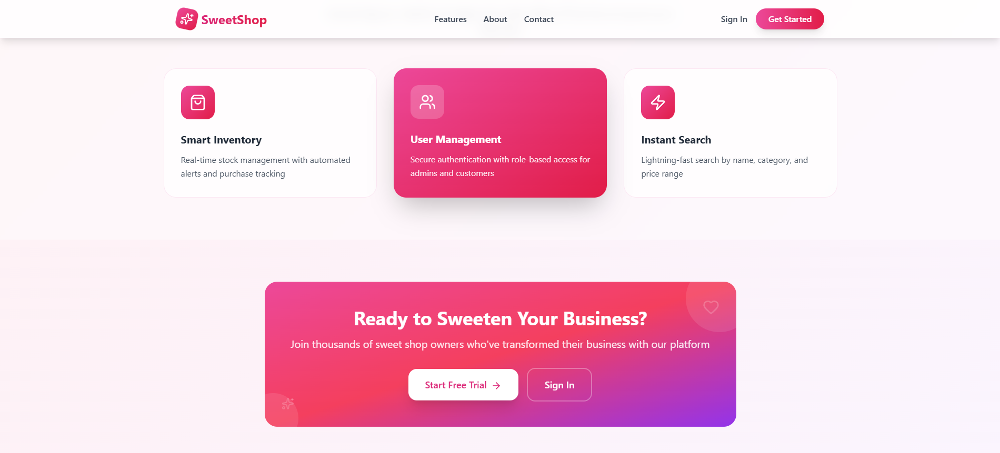
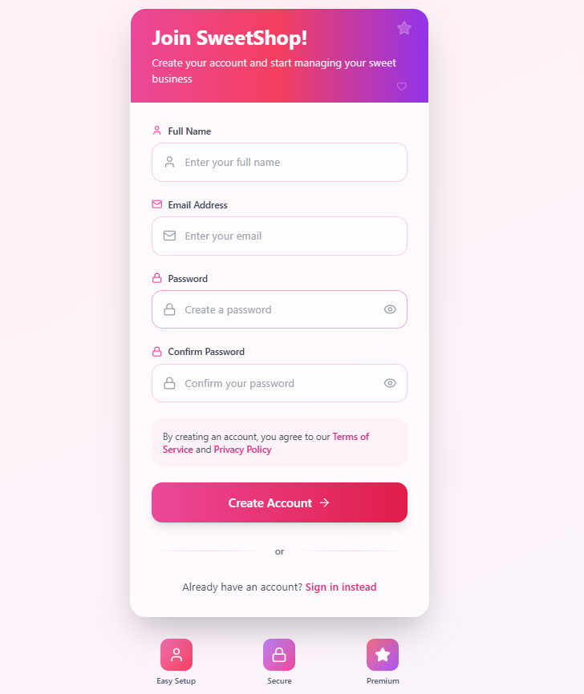
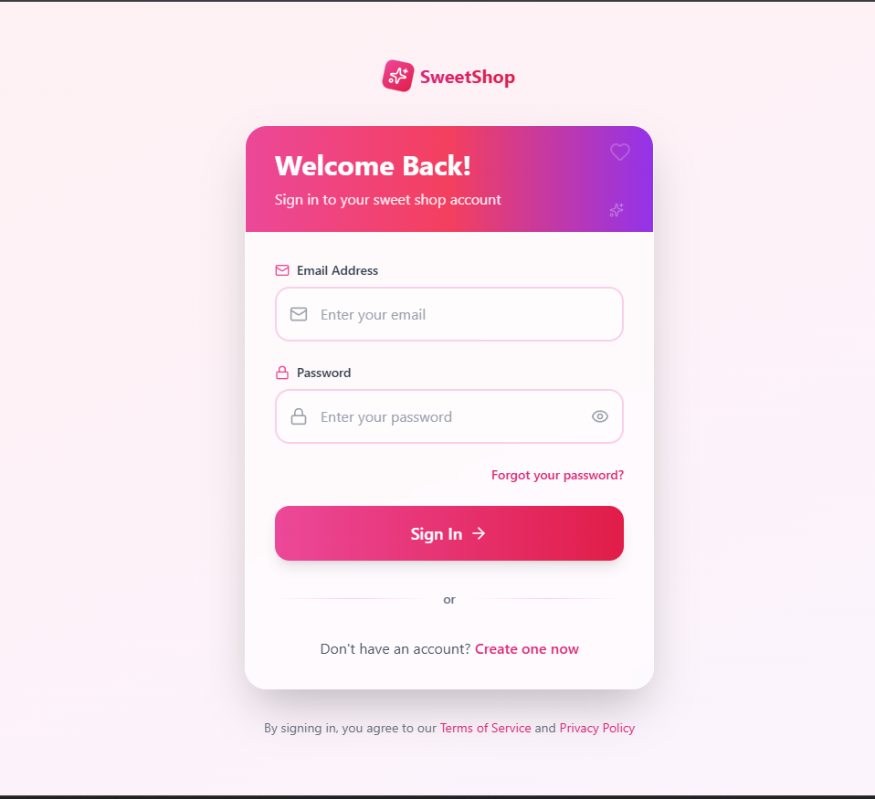
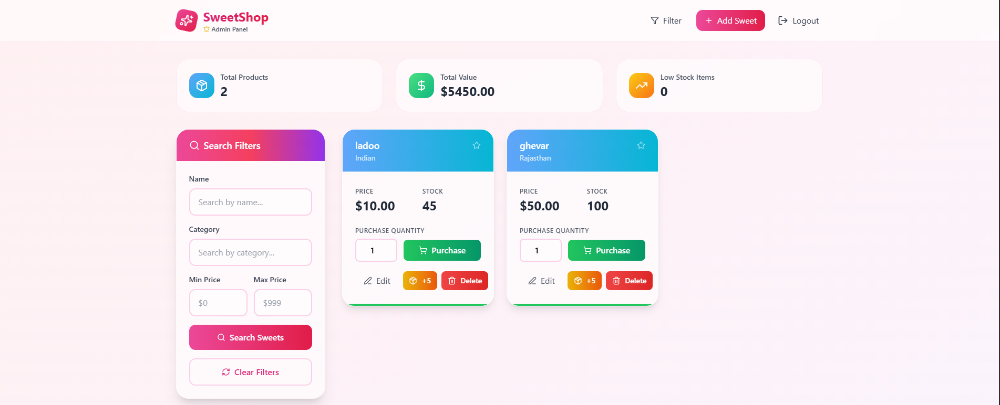
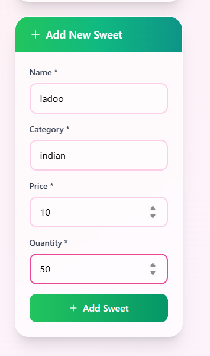
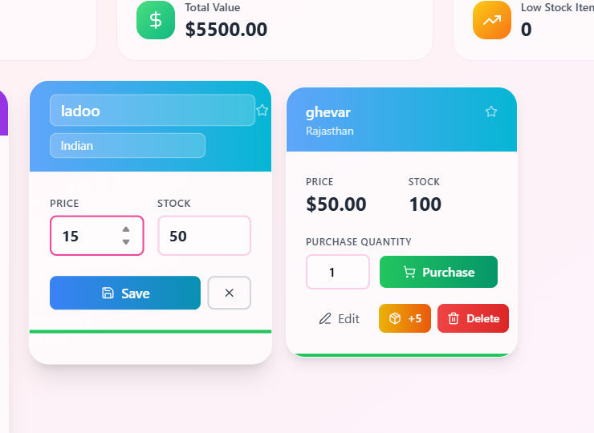
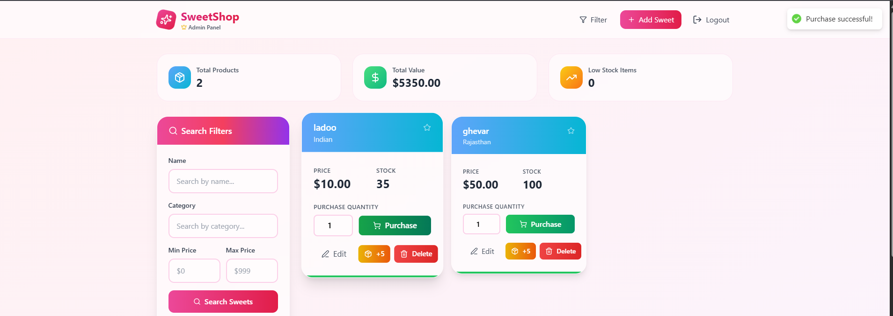
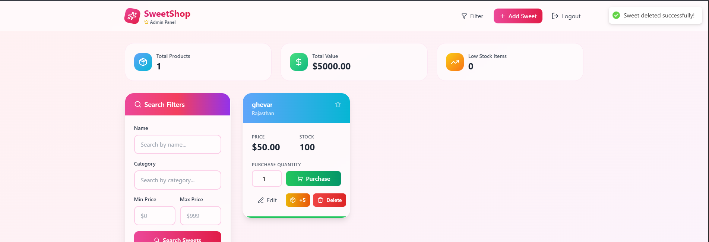

Sweet Shop Management System
============================

Project Overview
----------------

The **Sweet Shop Management System** is a full-stack application built as part of the TDD Kata. The project simulates a modern sweet shop where users can register, log in, browse, search, purchase sweets, and for admins, manage inventory.

The main objective of this project is to **demonstrate mastery of Test-Driven Development (TDD), clean code practices, RESTful API design, modern frontend development, and robust backend architecture**.

Screenshots
--------

### Landing Page

### Register Page

### Login Page

### Dashboard 

### Create new product

### update the product details

### purchasing the product

### Restock the product (Admin only)

### Delete the product (Admin only)

### searching product / Filtering 

### Logout 

Features
--------

### Authentication

*   User registration (POST /api/auth/register)
    
*   User login (POST /api/auth/login)
    
*   JWT-based authentication for protected routes & Admin Access.
    

### Sweet Management (Protected)

*   Add a new sweet (POST /api/sweets)
    
*   View all sweets (GET /api/sweets)
    
*   Search sweets by name, category, price range (GET /api/sweets/search)
    
*   Update sweet details (PUT /api/sweets/:id)
    
*   Delete sweet (Admin only) (DELETE /api/sweets/:id)
    

### Inventory Management (Protected)

*   Purchase sweets (POST /api/sweets/:id/purchase)
    
*   Restock sweets (Admin only) (POST /api/sweets/:id/restock)
    

### Frontend

*   Modern SPA using **React**
    
*   User-friendly dashboard to browse sweets
    
*   Search and filter functionality
    
*   Purchase button disabled if quantity is zero
    
*   Admin UI for managing sweets
    
*   Responsive and visually appealing design with **Tailwind CSS**
    

## Tech Stack

| Layer       | Technology  | Why We Used It |
|------------|------------       |----------------|
| Backend    | Node.js + Express | Lightweight, fast, and perfect for REST APIs |
| Frontend   | React + Vite      | Modern SPA framework with fast build times |
| Language   | TypeScript        | Strong typing improves maintainability & reduces runtime errors |
| Validation | Zod               | Runtime validation for request bodies and forms |
| Styling    | Tailwind CSS      | Rapid, responsive, utility-first styling |
| Auth       | JWT + bcrypt      | Secure token-based authentication and password hashing |
| Database   | MongoDB            | Flexible NoSQL database for storing users and sweets |
| Testing    | Vitest + Supertest | Full TDD workflow for backend API endpoints |
| Routing    | React Router       | SPA navigation and protected routes |

---

Test-Driven Development (TDD)
-----------------------------

This project strictly follows **TDD principles**:

1.  **Red** – Write failing tests for the desired functionality.
    
2.  **Green** – Implement the minimum code to pass the tests.
    
3.  **Refactor** – Clean up code while keeping tests green.
    

*   We wrote **~40-50 test cases** covering:
    
    *   API endpoints
        
    *   Authentication
        
    *   Sweet CRUD operations
        
    *   Inventory management
        
    *   Validation and error handling
        
*   Every backend feature was developed using the **Red-Green-Refactor cycle**, ensuring robust and bug-free code before deployment.

---

## Setup & Run

### Backend
cd backend
npm install
npm run dev      # Starts the server in development mode
npm run build    # Compiles TypeScript to JS
npm run test     # Runs all test cases

### Frontend

cd frontend
npm install
npm run dev      # Starts Vite dev server
npm run build    # Compiles React app for production

### .env
#### BACKEND_URL=http://localhost:5000

#### MONGO_URI=your_mongodb_connection_string

#### JWT_SECRET=your_secret_key

Deployment
----------

*   **Frontend:** Deployed on Vercel (Vite preset, output directory dist)
    
*   **Backend:** Can be deployed on Vercel (Node.js preset) or any cloud provider
    
*   Ensure CORS is properly configured for frontend-backend communication.
    

My AI Usage
-----------

AI tools were used to enhance productivity while ensuring manual review and improvement:

*   **Tools:** ChatGPT, claude
    
*   **Usage:**
    
    *   Generated boilerplate code for controllers, routes, and services
        
    *   Assisted in writing unit and integration tests
        
    *   Suggested validation and error handling logic & complete frontend UI & design
        
*   **Reflection:** AI accelerated repetitive coding tasks but all business logic, test assertions, and design decisions were manually verified to ensure correctness and maintainability.
    

All commits using AI include proper **co-author trailers** for transparency.

Testing Report
--------------

*   **Total Test Cases:** ~40-50
    
*   **Coverage:** API endpoints, authentication, CRUD operations, validations
    
*   **Frameworks:** Vitest, Supertest
    

Conclusion
----------

This project demonstrates the power of **TDD, clean code, and modern full-stack development practices**. By combining TypeScript, Node.js, React, and rigorous testing, we built a maintainable, secure, and user-friendly Sweet Shop Management System.

Deployed links (if available) and screenshots of the final application can be found below.